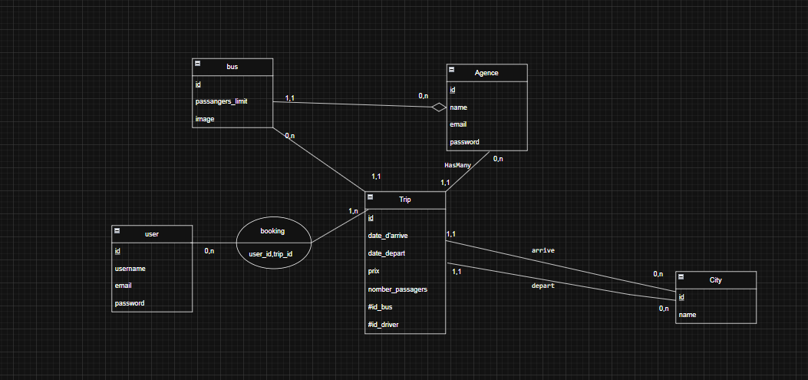
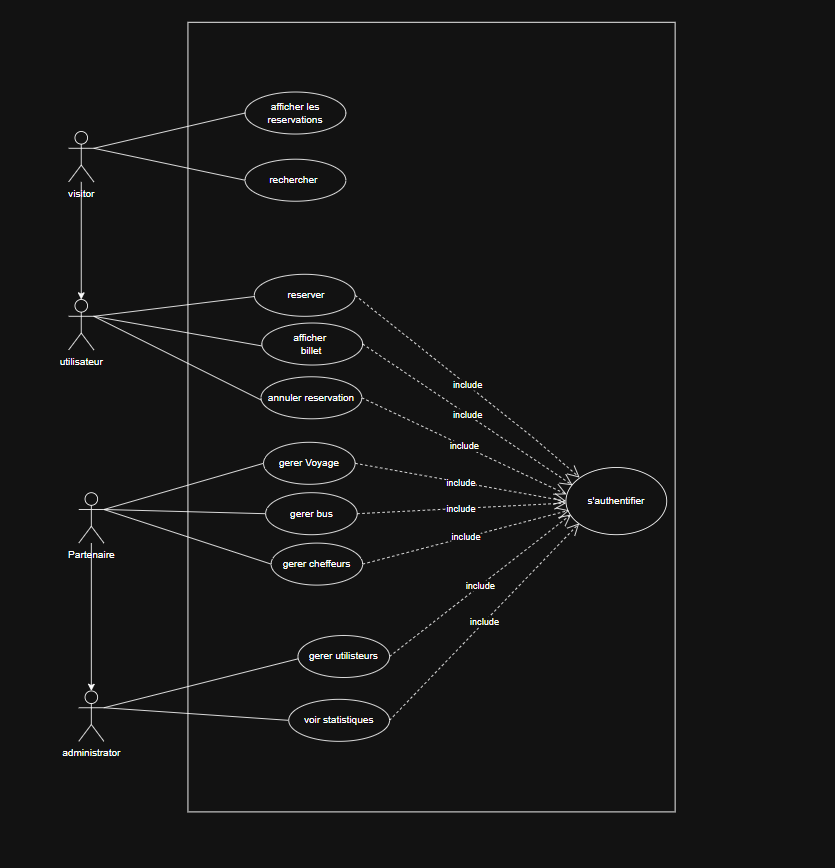

# 🚌 Projet : BookBus (Clone marKoub.ma)

> **Documentation d'Analyse et d'Architecture** > _Statut : Phase de Conception_ | _Date : 26 Janvier 2026_

---

## 📂 A. Analyse du Domaine

### 1. Processus de Réservation (Flux Utilisateur)

Le parcours utilisateur a été modélisé pour garantir une expérience fluide, similaire à celle de marKoub.ma :

- 🔍 **Recherche :** L'utilisateur définit sa ville de départ, sa destination et la date du voyage.
- 🚌 **Sélection :** Affichage dynamique des trajets disponibles avec filtrage par prix ou horaire.
- 💺 **Détails & Sièges :** Choix précis du siège dans le bus et saisie des informations passagers.
- 🎟️ **Validation :** Confirmation de la réservation et génération automatique du billet.

### 2. Entités Principales Identifiées

| Entité                     | Rôle dans le système                                                       |
| :------------------------- | :------------------------------------------------------------------------- |
| **Utilisateur (User)** | Gère les profils Clients et les accès Administrateurs. |
| **Ville (City)** | Référentiel des points de départ et d'arrivée au Maroc.|
| **Bus** | Gère le parc de véhicules et leur capacité maximale.    |
| **Voyage (Trip)** | L'entité pivot liant une ville A à une ville B avec un prix et un horaire. |
| **Réservation (Booking)** | Enregistre l'achat d'un siège par un utilisateur pour un voyage précis. |

### 3. Flux d'Administration

L'administrateur dispose d'une interface de gestion permettant de :

- Maintenir à jour la liste des **villes** desservies.
- Gérer la flotte de **bus** (ajout/suppression/maintenance).
- Planifier les **trajets** (Trip Management).
- Superviser l'ensemble des **réservations** clients.

---

## 🏗️ B. Proposition d'Architecture

### 1. Schéma de Base de Données (MCD/ERD)

L'architecture repose sur une base relationnelle de **5 tables minimum** :

  

- **users** : `id, name, email, password, role`
- **cities** : `id, name`
- **buses** : `id, name, capacity`
- **trips** : `id, bus_id, departure_city_id, arrival_city_id, price, departure_time`
- **bookings** : `id, user_id, trip_id, seat_number, status`

### 2. Fonctionnalités MVP (Minimum Viable Product)

- [x] **Authentification :** Système complet via Laravel Breeze (Login/Register).
- [x] **Gestion des Trajets :** Possibilité pour l'admin de créer des liaisons entre villes.
- [x] **Moteur de Recherche :** Recherche simple par ville et par date.
- [x] **Réservation :** Capacité de réserver un siège sur un voyage spécifique.

### 3. Diagrammes UML

#### **Diagramme de Cas d'Utilisation**

#### **Diagramme de Classes**
Organisation des classes basée sur le pattern Active Record (Eloquent ORM) de Laravel.

---

## 🛠️ C. Choix Techniques

### 1. Justification de Laravel

Le choix de **Laravel 10** repose sur plusieurs piliers stratégiques :

- **Productivité :** Les outils comme Artisan et Eloquent ORM permettent de développer le MVP en un temps record.
- **Sécurité :** Gestion native des protections contre les failles courantes (CSRF, XSS, Injections SQL).
- **Maintenabilité :** L'架构 MVC de Laravel assure une séparation claire entre la logique métier et l'affichage.

### 2. Dépendances PHP/Laravel nécessaires

- **PHP 8.2+** : Pour bénéficier des dernières performances du langage.
- **Composer** : Pour la gestion des packages.
- **Laravel Breeze** : Pour une authentification robuste et rapide.
- **MySQL** : Pour le stockage structuré des données de transport.

---

_Projet réalisé dans le cadre du cursus de développement Web._